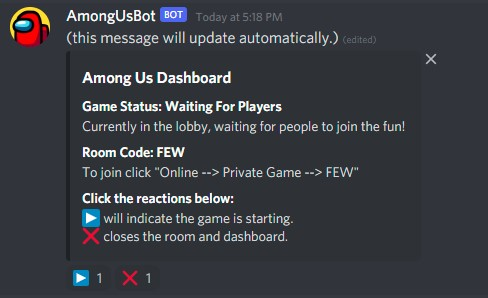
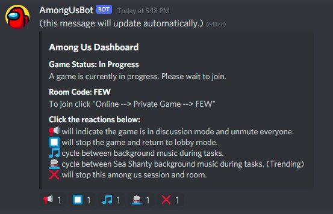
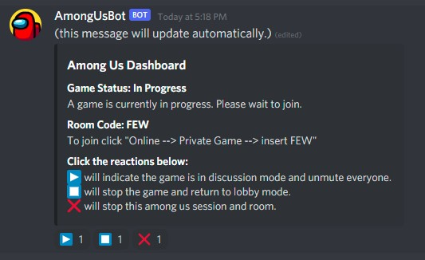

# among-us-discord-bot
This is the self-hosted Among Us Discord Bot that The Mindsweepers use to facilitate our games. It contains a menu system utilizing reactions to control the game.

## How to run with Docker
The following are the docker commands to run the bot.
`docker build --tag among-us-bot-node .`
`docker run -env_file=env_file --name among-us-bot-node among-us-bot-node`

## Config
Be sure to change the values in the config.json file.

## Features
- User Interface is built to control the bot with reactions.
- Immersive sound effects.
- Server mute everyone in a voice channel.
- Background music, so we don't sit in silence. We also have a category for shanty music. 😁
- Displays the room code and instructions to let people know when to join between rounds.

## Music
Our group used Among Us music and Sea Shanty music to set the mood. Unfortunately those are copyrighted from Youtube videos, so we cannot include them in this repository. You will need to provide that yourself separately.

## Screenshots

